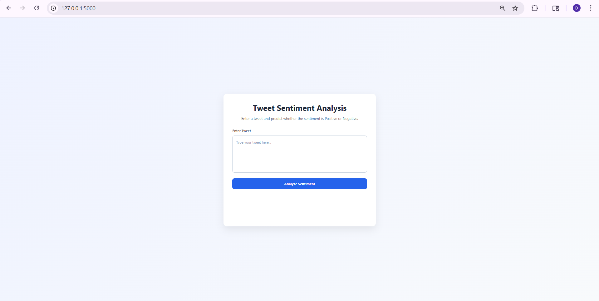
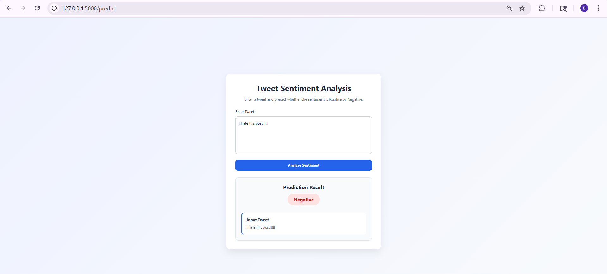

# 🧠 NLP Twitter Sentiment Analysis (Flask App)

## 📌 Project Overview

This project is a **Machine Learning-based Sentiment Analysis system** that classifies tweets as **Positive** or **Negative** using Natural Language Processing (NLP).

The trained model is deployed as a **Flask web application**, allowing users to enter text and get real-time sentiment predictions.

---

## 🚀 Features

* 🔹 Text Cleaning (lowercasing, removing URLs, special characters)
* 🔹 Stopword Removal using NLTK
* 🔹 Lemmatization with POS tagging
* 🔹 TF-IDF Vectorization with n-grams (1 to 3)
* 🔹 Model comparison:

  * Multinomial Naive Bayes
  * Logistic Regression (best model)
* 🔹 Real-time prediction using Flask
* 🔹 Clean modular project structure

---

## 🧠 Machine Learning Workflow

1. Data Collection (Twitter dataset)
2. Data Cleaning
3. Text Preprocessing
4. Feature Extraction (TF-IDF)
5. Train-Test Split
6. Model Training
7. Model Evaluation
8. Model Deployment using Flask

---

## 📊 Model Performance

### 🏆 Logistic Regression (Best Model)

* Accuracy: **~78%**
* F1 Score: **~0.77**
* Balanced Precision & Recall

### 🔹 Multinomial Naive Bayes

* Accuracy: **~76%**
* F1 Score: **~0.75**

👉 Logistic Regression performed better in terms of overall balance and recall.

---

## 🖥️ Web Application

The Flask app allows users to:

* Enter a tweet/text
* Get instant sentiment prediction

### Output:

* ✅ Positive Sentiment
* ❌ Negative Sentiment

---

## 📸 Screenshots

### 🏠 Home Page



### 🔍 Prediction Page



---

## 📂 Project Structure

```
nlp-twitter-sentiment-analysis/
│
├── app.py
├── model/
│   ├── sentiment_model.pkl
│   └── tfidf_vectorizer.pkl
│
├── utils/
│   └── preprocessing.py
│
├── templates/
│   └── index.html
│
├── static/
│   └── style.css
│
├── requirements.txt
├── Procfile
└── README.md
```

---

## ⚙️ Technologies Used

* Python 🐍
* Pandas & NumPy
* NLTK (Natural Language Toolkit)
* Scikit-learn
* Flask
* Joblib
* HTML/CSS

---

## ▶️ How to Run Locally

```bash
# Clone repository
git clone https://github.com/DhuruvanShanker-9426/nlp-twitter-sentiment-analysis.git

# Navigate to project folder
cd nlp-twitter-sentiment-analysis

# Install dependencies
pip install -r requirements.txt

# Run Flask app
python app.py
```

Then open:

```
http://127.0.0.1:5000/
```

---

## 🌐 Deployment

This project is deployed using **Render**, enabling real-time sentiment prediction through a web interface.

---

## 🔐 Environment Variables (Optional)

Create a `.env` file:

```
MODEL_PATH=model/sentiment_model.pkl
TFIDF_VECTORIZER_PATH=model/tfidf_vectorizer.pkl
DEBUG=False
```

---

## 💡 Future Improvements

* Add Neutral sentiment class
* Use Deep Learning models (LSTM, BERT)
* Improve UI/UX design
* Add REST API endpoint
* Deploy using Docker

---

## 🎯 Key Learnings

* End-to-end NLP pipeline
* Text preprocessing techniques
* Feature engineering with TF-IDF
* Model comparison and evaluation
* Flask deployment

---

## 👨‍💻 Author

**Dhuruvan Shanker R**

* Aspiring Data Scientist / ML Engineer
* Interested in NLP, AI/ML, and Data Analytics

---

## ⭐ If you like this project

Give it a ⭐ on GitHub!